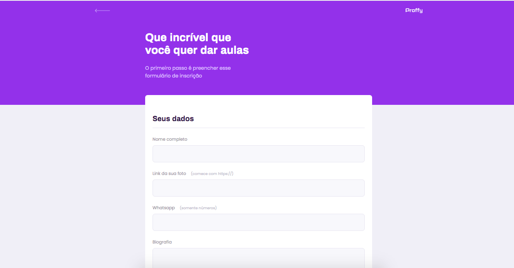
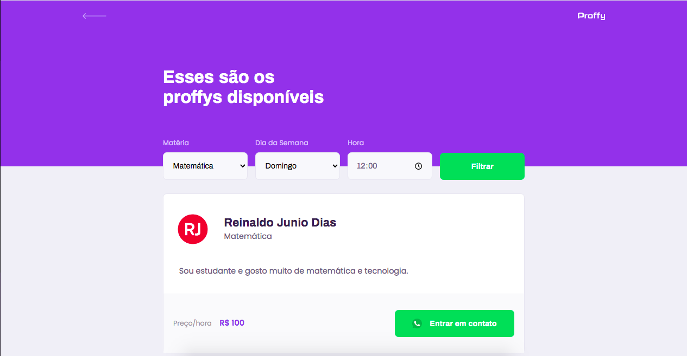

   

	
   
  

   
  
  

> Repositório com o estudo realizado na Next Level Week #2, da Rocketseat, com o objetivo de conectar professores particulares e estudantes.

### Web Screenshot

   
   
   

### Mobile Screenshot

   
   
   

# :computer: Tecnologias
Esse projeto foi feito utilizando as seguintes tecnologias:

* [NodeJs](https://nodejs.org/en/)      
* [SQLite](https://www.sqlite.org/index.html)      

# :rocket: Funcionalidades

* Site para cadastro e busca de professores 
